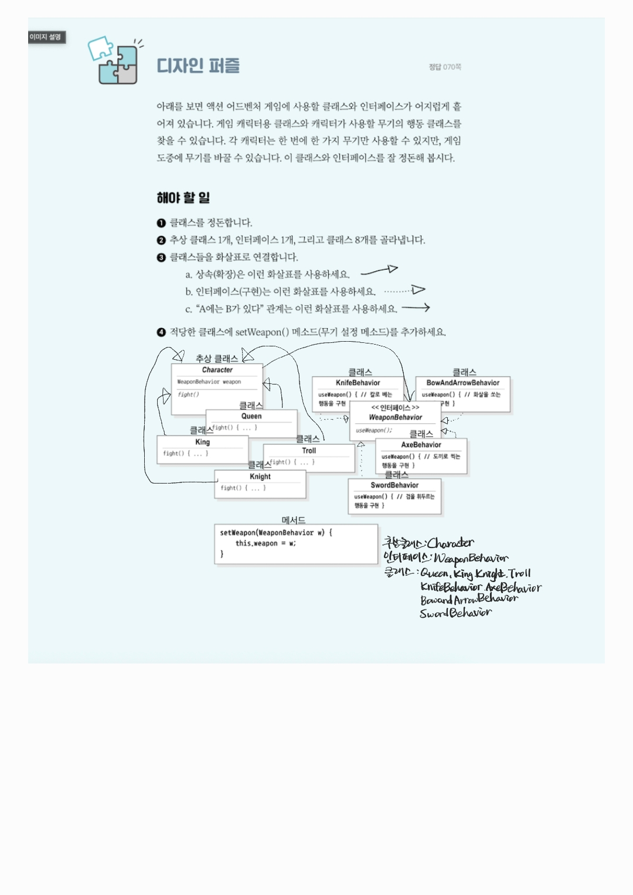

# **전략 패턴**
**여러 알고리즘 또는 행위를 각각 클래스로 캡슐화하고, 실행 시점에 필요에 따라 동적으로 교체하여 사용할 수 있도록 하는 행위** 디자인 패턴입니다.
이 패턴을 사용하면 클라이언트 코드를 수정하지 않고도 객체의 행위를 유연하게 변경하고 확장할 수 있습니다.

## **1.핵심 구조**
>-**Strategy (인터페이스)**: 모든 전략이 공통으로 가져야 할 메서드를 정의합니다.
>-**ConcreteStrategy (구현 클래스)**: 실제 알고리즘을 구현한 다양한 형태의 클래스들입니다.
>-**Context (컨텍스트)**: 전략을 사용하는 주체입니다. 전략 객체를 가지고 있으며, 필요에 따라 이를 실행합니다.

## **2.작동 방식 및 이점**
>-**동적 행위 변경**: 실행 중에 컨텍스트가 사용하는 전략 객체를 변경함으로써 객체의 동작을 실시간으로 바꿀 수 있습니다.
>-**OCP 준수**: 개방-폐쇄 원칙(Open/Closed Principle)을 따릅니다. 새로운 전략을 추가하더라도 기존 클라이언트 코드를 수정할 필요가 없습니다.
>ocp란 객체지향 설계의 5대 원칙(SOLID)중 하나로, 소프트웨어 구성 요소(클래스,모듈, 함수 등)는 확장에는 열려 있어야 하고, 수정에는 닫혀 있어야 한다는 원칙입니다
>-**코드의 유연성 및 재사용성**: 각 알고리즘이 독립적인 클래스로 분리되어 관리되므로 코드가 더 깔끔해지고 재사용성이 높아집니다.


## Task 1 파이썬 코드
```python
from abc import ABC, abstractmethod

class WeaponBehavior(ABC):
    @abstractmethod
    def use_weapon(self):
        pass

class KnifeBehavior(WeaponBehavior):
    def use_weapon(self):
        print("칼로 베는 행동을 구현")

class BowAndArrowBehavior(WeaponBehavior):
    def use_weapon(self):
        print("화살을 쏘는 행동을 구현")

class AxeBehavior(WeaponBehavior):
    def use_weapon(self):
        print("도끼로 찍는 행동을 구현")

class SwordBehavior(WeaponBehavior):
    def use_weapon(self):
        print("검을 휘두르는 행동을 구현")

class Character(ABC):
    def __init__(self):
        self.weapon: WeaponBehavior = None
    
    @abstractmethod
    def fight(self):
        pass

    def set_Weapon(self, w : WeaponBehavior):
        self.weapon = w

    def perform_fight(self):
        if self.weapon:
            self.weapon.use_weapon()
        else:
            print("무기가 없습니다")

class Queen(Character):
    def fight(self):
        print("여왕이 전투를 시작합니다.")

class King(Character):
    def fight(self):
        print("국왕이 전투를 시작합니다.")

class Troll(Character):
    def fight(self):
        print("트롤이 전투를 시작합니다.")

class Knight(Character):
    def fight(self):
        print("기사가 전투를 시작합니다.")
```


